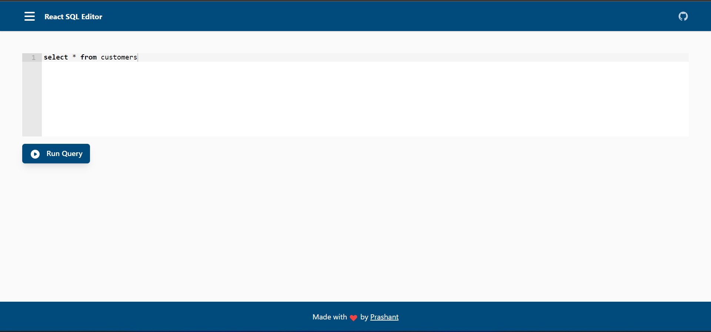
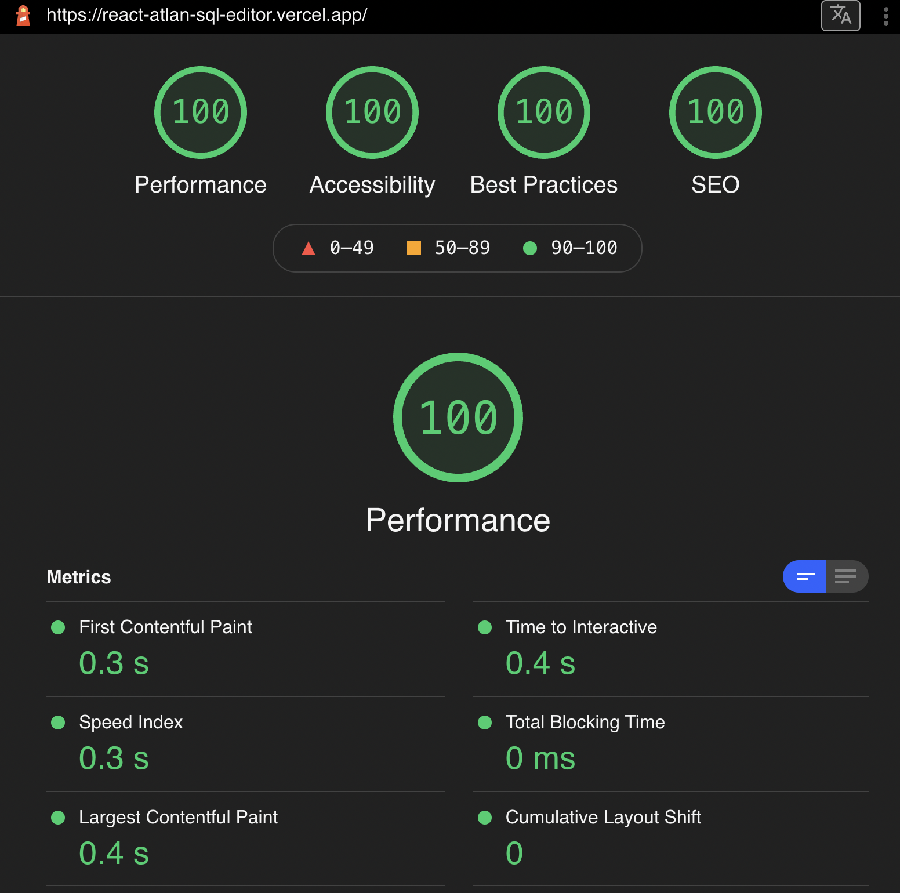
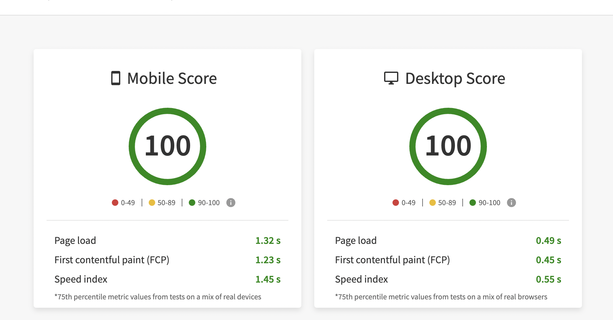

# 🚀 REACT SQL Editor

This is a REACT SQL Editor built using ReactJs and TailwindCSS.

## 👨‍💻 Demo
Try out the website : [REACT SQL Editor](https://atlan-frontend-task.netlify.app/)

## 👨‍🔧 Tech Stack

## 👨‍💻 Features

:white_check_mark: Users can get data of any of the predefined SQL queries either by using SQL Editor or Sidebar Menu.\
:white_check_mark: Users can sort data directly by clicking the Table Headers title.\
:white_check_mark: Users can search for a particular data among many records using the search bar.\
:white_check_mark: Users can navigate to different pages using pagination.\
:white_check_mark: Users can download the data in CSV and JSON Format in just one click.\
:white_check_mark: Users can see query runtime in milliseconds(ms).

## ✍️ Predefined SQL Queries

- `select * from customers`
- `select * from categories`
- `select * from employee_territories`
- `select * from order_details`
- `select * from orders`
- `select * from products`
- `select * from regions`
- `select * from shippers`
- `select * from suppliers`
- `select * from territories`

## ⏱ Page Load Time

Page Load time of this website in desktop is in the range of 0.4 s to 0.6s.

I calculated the performance and load time of this website using these two tools Lighthouse Chrome DevTools and BrowserStack SpeedLab.

### [Lighthouse Chrome DevTools Report](https://developers.google.com/web/tools/lighthouse#devtools) (got a perfect 💯)

- **First Contentful Paint** marks the time at which the first text or image is painted
- **Time to interactive** is the amount of time it takes for the page to become fully interactive.
- **Speed Index** shows how quickly the contents of a page are visibly populated.
- **Total Blocking Time** is the sum of all time periods between FCP and Time to Interactive, when task length exceeded 50ms, expressed in milliseconds.
- **Largest Contentful Paint** marks the time at which the largest text or image is painted.
- **Cumulative Layout Shift** measures the movement of visible elements within the viewport.

### [BrowserStack Report](https://www.browserstack.com/speedlab)

## 🪜 Steps I took to optimize the page load time

- Used code-splitting with `React.Lazy()` and `Suspense` to lazy load the components and split javaScript into multiple chunks using Dynamic runtime Imports for faster page load.
- Used `React.Memo()` to optimize the render performance of functional components.
- Used PurgeCSS to tree-shake unused styles and optimize my final build size.
- Used Lighthouse DevTools Extension to find the performance issues and fix them using their actionable suggestion.
- Used vercel to deploy this website to leverage its Vercel Edge Network compression that results in the better performance.

## Available Scripts

In the project directory, you can run:

### `yarn start`

Runs the app in the development mode.\
Open [http://localhost:3000](http://localhost:3000) to view it in the browser.

The page will reload if you make edits.\
You will also see any lint errors in the console.

### `yarn build`

Builds the app for production to the `build` folder.\
It correctly bundles React in production mode and optimizes the build for the best performance.

The build is minified and the filenames include the hashes.\
Your app is ready to be deployed!

See the section about [deployment](https://facebook.github.io/create-react-app/docs/deployment) for more information.
